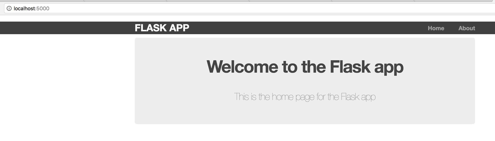

# Flask-Basic

Quick and dirty wireframe for getting a Flask app up quickly.

# Prerequisites

Must have Flask installed

```
pip install flask
```

# Usage

Jump into the app directory and run 

```
python routes.py
```

And you'll have a web page up on your localhost at port 5000


# Modifications

You can change the port it's listening on in the `routes.py` file as well as the methods that it's calling for various root listeners (e.g., `<localhost>:5000/about`)

